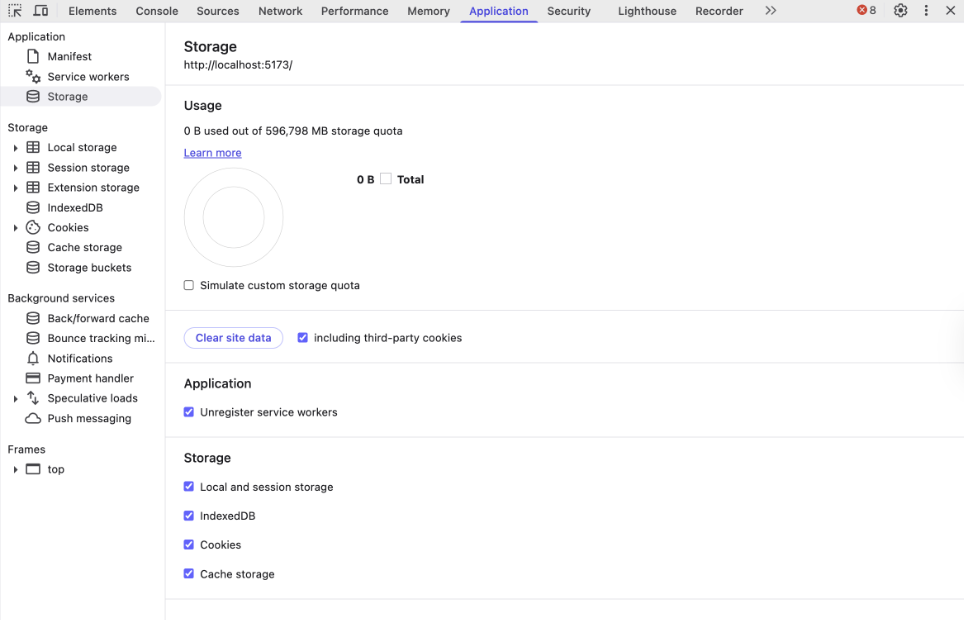
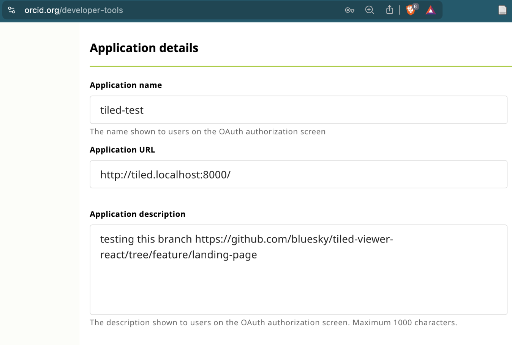
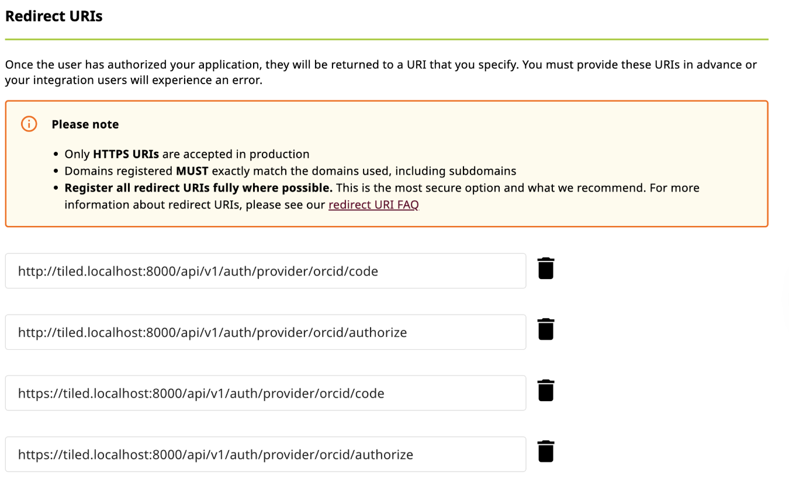

Installing the most recent version of Tiled for testing with this component
```bash
#example with conda
conda create -n tiled-latest python=3.11
conda activate tiled-latest
pip install "tiled[all]"
```

Now with the most recent version of tiled, you can run these config files.

```bash
#tiled-viewer-react/tiled
tiled serve config tiled_demo.yml
```

The main thing these config files do is allow origins to `localhost:5173` which is required when you're using a web browser to talk to a Tiled server. If you try to just run `tiled server demo` without any other parameters the Tiled server is going to reject communication from your browser running the tiled component.

# Auth troubleshooting
The Tiled component itself saves tokens into local storage that are used for authentication. In addition, cookies are saved by responses from the Tiled server. When starting to test the Auth provider versions of the Tiled component, it can sometimes be necessary to force clear your site data to prevent old cookies/tokens and cached responses from affecting the Tiled component.

In Chrome, you can force clear everything as shown below by right-click + inspect, then selecting 'Applications' in the dev tools menu.



# ORCID OIDC setup instructions
Setting up your local environment for ORCID OIDC will require having an ORCID account and creating some secrets from the ORCID website after logging in. The below instructions can be used for testing only.

## Ensure Tiled can process ORCID
https://github.com/bluesky/tiled/issues/1304
Tiled version 0.2.8 and below will not properly decode messages from ORCID, and a fix needs to be applied to your local Tiled per the code snippet on this issue. If on a version past 0.2.8, this fix may not be required if the issue has been closed.

## etc/hosts
First, modify your /etc/hosts file by adding one line:
```bash
#/etc/hosts
127.0.0.1 tiled.localhost
```

We will use `tiled.localhost` as our hostname.

## Create ORCID secrets
Go to https://orcid.org/developer-tools and create a client ID and secret for your tiled server.

In Application URL, put `http://tiled.localhost:8000`

In Redirect URIs, put the following
```
http://tiled.localhost:8000/api/v1/auth/provider/orcid/authorize
http://tiled.localhost:8000/api/v1/auth/provider/orcid/code
```



Now take those codes on this webpage and export them into the terminal running your tiled server
```bash
export ORCID_CLIENT_ID=paste-from-orcid
export ORCID_CLIENT_SECRET=paste-from-orcid
```


You'll also notice that the `<Tiled />` component specified for use with the OIDC flow has a few specific arguments:
```
<Tiled tiledBaseUrl='http://tiled.localhost:8000/api/v1' oidcRedirectUrl='http://localhost:5173'/>
```

The `oidcRedirectUrl` is provided as a state parameter in the initial request to Tiled for initiating the auth flow. This state parameter gets included in all the urls passed around with the OIDC flow. At the last step, Tiled will redirect to a utility website, which parses that state parameter and does a final redirect to your localhost. 

Why is this needed? Because without resolving the popup window to the same hostname as the original window running the app, the original window has no idea when to close the popup. We can assume that if the popup makes it back to localhost, that the flow is complete. The original window isn't allowed to peek at the contents of the popup window, it can only be alerted when the hostname matches for security reasons.

